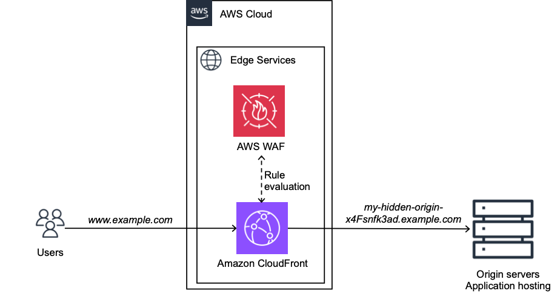

## How to boost the performance and security of your dynamic websites with AWS edge services in a few steps

Customers use AWS edge services to improve the performance and the security of their websites. In certain cases, they appreciate being able to quickly set up a Content Delivery Network (CDN) and a Web Application Firewall (WAF) to stop a DDoS attack targeting their website, or to decrease page load times. And they prefer doing this without investing time beforehand to read the service documentation and configure everything from scratch.

In this repo, you deploy just a few clicks, using an AWS CloudFormation template, an Amazon CloudFront distribution as a reverse proxy to your origin servers, protected by an AWS WAF WebACL. CloudFormation is a service that takes care of provisioning and configuring resources described in a YAML configuration template. CloudFront helps you accelerate your website thanks to caching when it applies, advanced internet protocols (e.g., HTTP3, TL1.3), and the AWS Global network. CloudFront natively protects your application against infrastructure DDoS attacks, and it integrates with AWS WAF to allow you to write rules for managing threats at application layer. 

Steps for deploying this template for your dynamic websites are described in this [blog post](https://aws.amazon.com/blogs/networking-and-content-delivery/how-to-boost-the-performance-and-security-of-your-dynamic-websites-with-aws-edge-services-in-a-few-steps/).

The provided solution is scoped to dynamic websites, such as Server Side Rendered frontends, which is served from origin servers, such as an Elastic Load Balancer (ELB), or servers that are on-premises. It helps you get started quickly with CloudFront and AWS WAF to protect and accelerate your dynamic website within minutes. After you get started, you can spend more time understanding the full capabilities of both services to further customize and improve the configuration for your application specific needs.

## Security

See [CONTRIBUTING](CONTRIBUTING.md#security-issue-notifications) for more information.

## License

This library is licensed under the MIT-0 License. See the LICENSE file.

