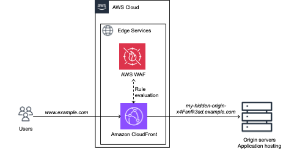

## Boost the performance and security of your dynamic website in few steps using AWS edge services

In this repo, we provide you with an AWS CloudFormation template that allows you to deploy within few clicks, an Amazon CloudFront distribution as a reverse proxy to your origin servers, protected by an AWS WAF WebACL. CloudFront will help you accelerate your websites thanks to techniques such as caching if it applies, AWS Global network and advanced TCP optimizations. CloudFront natively protect your application against infrastructure DDoS attacks, and integrates with AWS WAF, to allow you to write rules for managing threats at application layer. 

Note that the provided solution is scoped to dynamic websites, such as a Server Side Rendered frontends, with some static content, that is served from origin servers, such as an Elastic Load balancer, or servers on premises. 

## Security

See [CONTRIBUTING](CONTRIBUTING.md#security-issue-notifications) for more information.

## License

This library is licensed under the MIT-0 License. See the LICENSE file.

